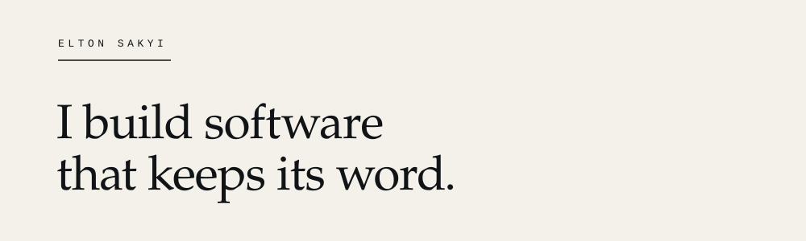
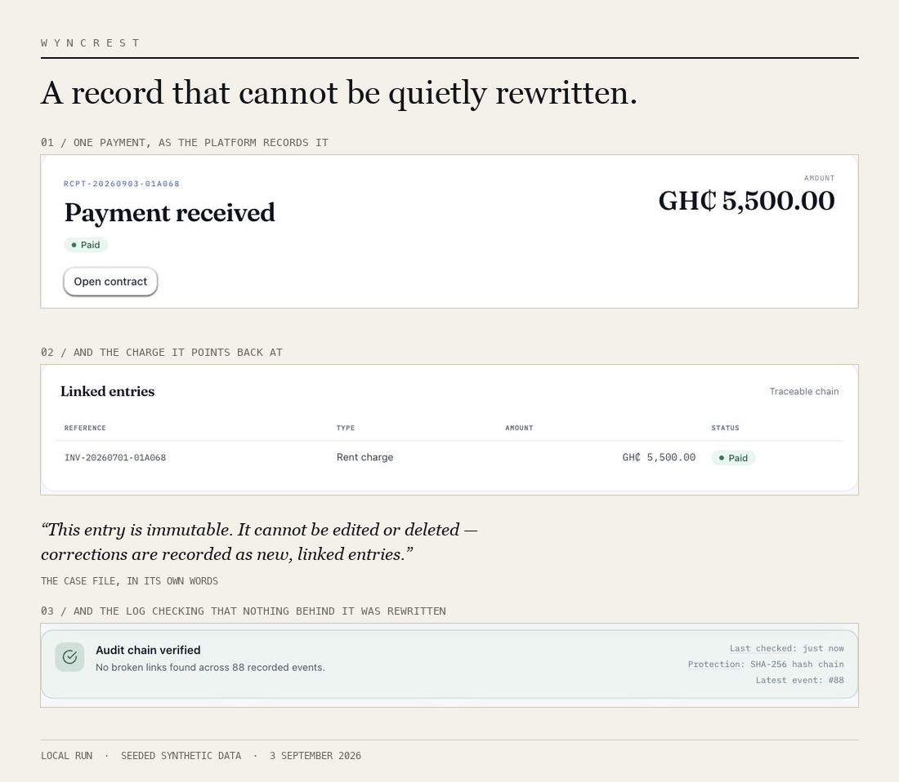
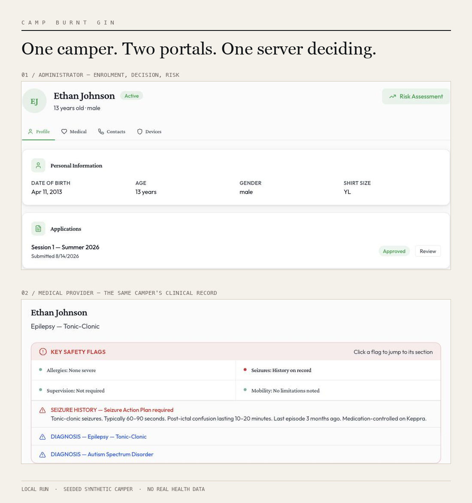
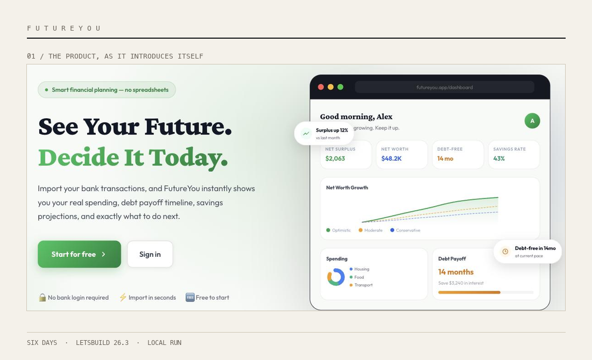

<picture>
  <source media="(prefers-color-scheme: dark)" srcset="assets/wordmark-dark.svg">
  
</picture>

I work across backend systems and product interfaces, especially where money, access, records, or consequential decisions are involved. My work turns complicated operations into software people can inspect, understand and trust.

**[Portfolio](https://elton-sakyi-portfolio.vercel.app)** &nbsp;·&nbsp; **[Résumé](https://elton-sakyi-portfolio.vercel.app/Elton_Sakyi_CV.pdf)** &nbsp;·&nbsp; **[LinkedIn](https://www.linkedin.com/in/elton-sakyi/)** &nbsp;·&nbsp; **[eltonsakyi@proton.me](mailto:eltonsakyi@proton.me)**

 

---

`01 · FLAGSHIP`

## Wyncrest

**A record that cannot be quietly rewritten.**

Rental operations built around a financial record that corrections can extend but never quietly rewrite.

**Invariant.** Ledger entries are written once, and a correction is a new entry pointing at the one it corrects.

**Enforcement.** The server checks every privileged action against a named capability, and writes the refusal into a hash-chained audit log.

**Verification.** 1,101 backend tests passing, [verified 3 September 2026](https://github.com/Knight-Frost/Wyncrest#test-verification).

`Public · Active development`

**[Repository](https://github.com/Knight-Frost/Wyncrest)** &nbsp;·&nbsp; [Authorization model](https://github.com/Knight-Frost/Wyncrest/blob/main/docs/AUTHORIZATION.md)

---

`02 · FLAGSHIP`

## Camp Burnt Gin

**One camper. Two portals. One server deciding.**

Camp Burnt Gin coordinates enrolment and medical workflows across four role-scoped portals for a state programme serving children with special health care needs. Its central rule is deliberately strict: administrative authority should not carry access to a camper's medical record. Where that boundary does not yet hold, the repository says so before it says anything else about access. I served as primary engineer for the current platform within a four-person capstone team.

`Public · No public deployment`

**[Repository](https://github.com/Knight-Frost/camp-burnt-gin-platform)** &nbsp;·&nbsp; [Contributor record](https://github.com/Knight-Frost/camp-burnt-gin-platform/blob/main/CONTRIBUTORS.md) &nbsp;·&nbsp; [Authorization model](https://github.com/Knight-Frost/camp-burnt-gin-platform/blob/main/docs/roles-and-permissions/Roles_and_Permissions.md)

 

`Laravel · PHP · React · TypeScript · Next.js · Java · Spring Boot · Python · PostgreSQL`

---

`03 · SUPPORTING WORK`

### Portfolio

Four systems presented as places you move through rather than screenshots you scroll past. The camera and the scene transitions are hand written, and each project keeps its own narrative rather than collapsing into a grid of cards.

`Live · Maintained` &nbsp; **[Open it](https://elton-sakyi-portfolio.vercel.app)** &nbsp;·&nbsp; [Repository](https://github.com/Knight-Frost/portfolio)

### FutureYou

Six days at LetsBuild 26.3, built around one question: what does this money decision cost me later? A deterministic engine computes every projection, and the explanation layer may only describe what the engine already decided.

`Prototype · Hackathon build` &nbsp; **[Repository](https://github.com/Knight-Frost/Future-You)**

### Timeloop Snake

A Canvas game where a ghost of your previous run returns every fourteen seconds and repeats your moves. &nbsp; `Public · No longer deployed` &nbsp; [Repository](https://github.com/Knight-Frost/timeloop-snake)

---

`04 · HOW I WORK`

**01 · History remains visible.** Corrections add context rather than quietly replacing what happened. [`create_ledger_entries_table.php`](https://github.com/Knight-Frost/Wyncrest/blob/main/database/migrations/2024_01_01_000015_create_ledger_entries_table.php)

**02 · Permission is enforced.** The server decides who may act, regardless of what the interface displays. [`EnsureAdminCan.php`](https://github.com/Knight-Frost/Wyncrest/blob/main/app/Http/Middleware/EnsureAdminCan.php)

**03 · Absence stays honest.** Missing information does not silently become zero, certainty, or approval. [`AdminCapability.php`](https://github.com/Knight-Frost/Wyncrest/blob/main/app/Enums/AdminCapability.php)

**04 · Claims carry evidence.** Important results point to the record, source, or document that supports them. [`AUTHORIZATION.md`](https://github.com/Knight-Frost/Wyncrest/blob/main/docs/AUTHORIZATION.md)

---

`05 · TOOLS AND OWNERSHIP`

I use AI tools to accelerate implementation and review. Architecture, security boundaries, product constraints and public claims remain my responsibility. The decisions that matter are documented in code, tests and technical records so the work can be inspected independently.

---

I am looking for a team where difficult systems, careful judgement and clear ownership matter.

`Backend and platform engineering roles` &nbsp;·&nbsp; **[Résumé](https://elton-sakyi-portfolio.vercel.app/Elton_Sakyi_CV.pdf)** &nbsp;·&nbsp; **[LinkedIn](https://www.linkedin.com/in/elton-sakyi/)** &nbsp;·&nbsp; **[eltonsakyi@proton.me](mailto:eltonsakyi@proton.me)**
