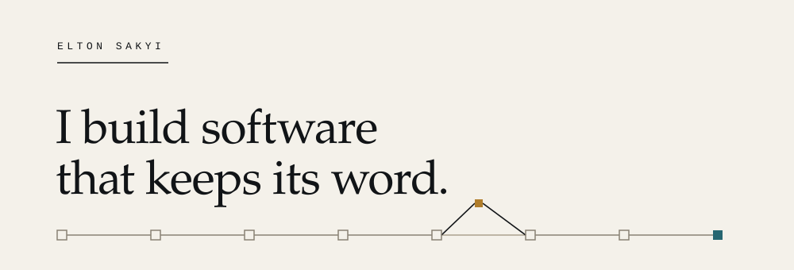
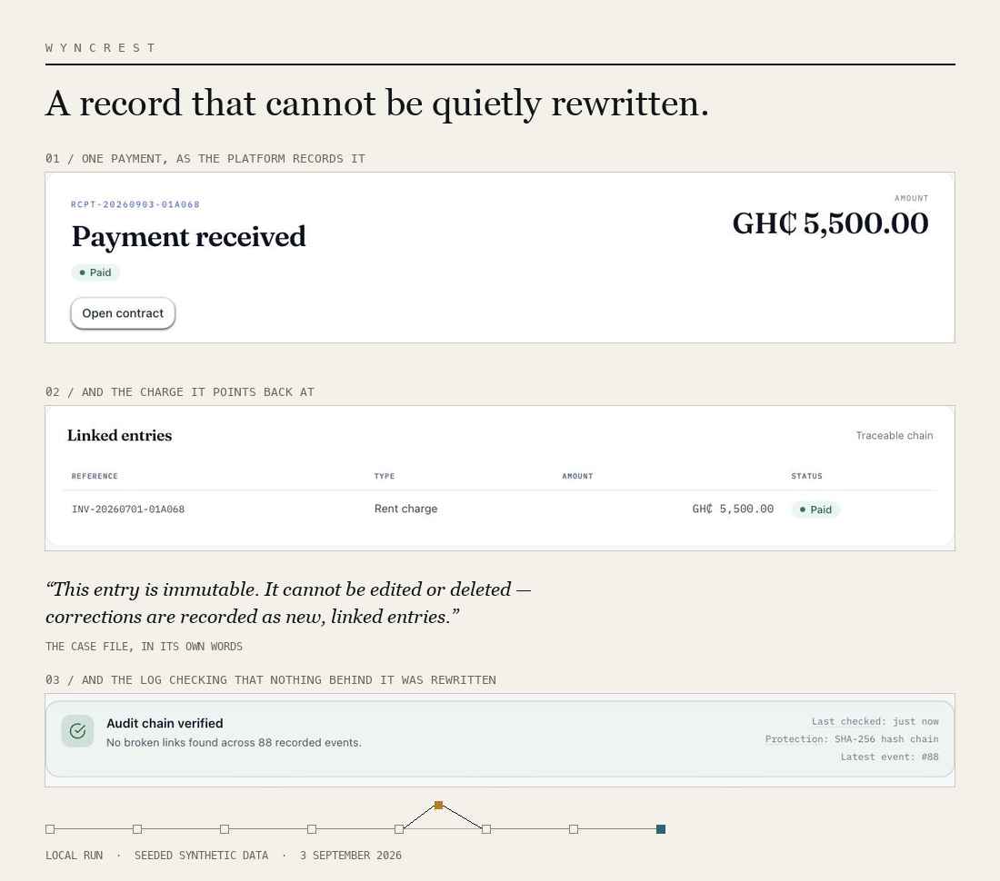
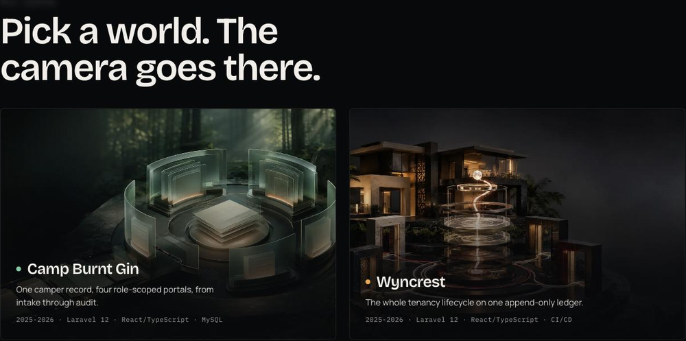

<picture>
  <source media="(prefers-color-scheme: dark)" srcset="assets/signature-dark.svg">
  
</picture>

Systems where permissions hold, records stay traceable, and consequential decisions carry their evidence.

I am a software engineer working across backend systems and the interfaces on top of them, most often where money, access, evidence, or a decision someone will be held to is involved.

**[Portfolio](https://elton-sakyi-portfolio.vercel.app)** &nbsp;·&nbsp; **[Résumé](https://elton-sakyi-portfolio.vercel.app/Elton_Sakyi_CV.pdf)** &nbsp;·&nbsp; **[LinkedIn](https://www.linkedin.com/in/elton-sakyi/)** &nbsp;·&nbsp; **[eltonsakyi@proton.me](mailto:eltonsakyi@proton.me)**

 

---

`01`

## Wyncrest

**A financial record that cannot be quietly rewritten.**

Rental operations for tenants, landlords and administrators, where every rent charge, late fee, payment and refund lands in one append-only ledger.

A dispute six months from now is settled by whatever that ledger says, so nothing already in it can be edited, and every privileged action has to leave a trace of its own.

**Invariant.** Ledger entries are written once. The table carries no `updated_at` column, and a correction is a new entry pointing at the one it corrects.

**Enforcement.** Admin actions are checked on the server against twelve named capabilities, and a refused check writes its own `admin_access_denied` event into a SHA-256 hash-chained audit log.

**Verification.** 1,101 backend tests passing across 4,507 assertions, from the test runner's own output, run on 3 September 2026.

`Public · Active development`

**[Repository](https://github.com/Knight-Frost/Wyncrest)** &nbsp;·&nbsp; [Authorization model](https://github.com/Knight-Frost/Wyncrest/blob/main/docs/AUTHORIZATION.md) &nbsp;·&nbsp; [Test verification](https://github.com/Knight-Frost/Wyncrest#test-verification)

---

`02`

## Camp Burnt Gin

**One camper record, four portals, and a server deciding which of them may read what.**

Enrolment, document compliance and medical workflows for the South Carolina programme serving children with special health care needs.

Four portals read one camper record, so the real question is never what a screen chooses to show. It is what the server will let a role load.

**Invariant.** Clinical access is conditioned on a camper being actively enrolled rather than on rank. The medical directory lists one camper where the administrator sees the whole applicant queue.

**Enforcement.** Role middleware, controller authorization and Eloquent policies each decide independently, and health data is encrypted at rest across 94 attributes.

**Disclosure.** The strict boundary does not hold for admin roles yet. The repository says so at the top of its access control section, before it says anything else about access.

`Public · No public deployment`

Built as a four person university capstone. I was the primary engineer for the current Laravel and React platform, including its authorization model, medical records domain, tests and CI. The complete contributor record is documented in the repository.

**[Repository](https://github.com/Knight-Frost/camp-burnt-gin-platform)** &nbsp;·&nbsp; [The medical data boundary](https://github.com/Knight-Frost/camp-burnt-gin-platform/blob/main/README.md#3-the-medical-data-boundary) &nbsp;·&nbsp; [Contributors](https://github.com/Knight-Frost/camp-burnt-gin-platform/blob/main/CONTRIBUTORS.md)

 

`Laravel · PHP · React · TypeScript · Next.js · Java · Spring Boot · Python · PostgreSQL`

---

`03`

## Also public

### Portfolio

Four systems presented as places you move through rather than screenshots you scroll past. The camera, the scroll choreography and the scene transitions are hand written against one animation frame loop, with no animation library underneath.

`Live · Maintained` &nbsp; **[Open it](https://elton-sakyi-portfolio.vercel.app)** &nbsp;·&nbsp; [Repository](https://github.com/Knight-Frost/portfolio)

### FutureYou

Six days at LetsBuild 26.3, aimed at one question: what does this money decision actually cost me later? A deterministic engine computes every projection, and the explanation layer is only allowed to describe what the engine already decided.

`Prototype · Hackathon build` &nbsp; **[Repository](https://github.com/Knight-Frost/Future-You)**

### Timeloop Snake

A Canvas game where a ghost of your previous run returns every fourteen seconds and repeats your moves. `Public · No longer deployed` &nbsp; [Repository](https://github.com/Knight-Frost/timeloop-snake)

---

`04`

## In private development

**Policora** ties each extracted insurance policy fact back to the page it came from. **Pathfinder** joins federal labour and education data without losing which source each figure came from. Both stay private until their publication and licensing review is finished, so neither is linked here.

`Private · Publication review`

---

`05`

## How I work

**01 · History is preserved.** A correction adds an entry. It does not quietly overwrite the one that was wrong. [`create_ledger_entries_table.php`](https://github.com/Knight-Frost/Wyncrest/blob/main/database/migrations/2024_01_01_000015_create_ledger_entries_table.php)

**02 · Permission is enforced.** An interface can guide someone away from an action. Only the server can refuse it, and the refusal is written down. [`EnsureAdminCan.php`](https://github.com/Knight-Frost/Wyncrest/blob/main/app/Http/Middleware/EnsureAdminCan.php)

**03 · Absence stays visible.** A missing figure renders as missing. It is never quietly converted into a zero, a certainty, or an approval. [`AdminCapability.php`](https://github.com/Knight-Frost/Wyncrest/blob/main/app/Enums/AdminCapability.php)

**04 · Claims carry evidence.** A result that matters points back at the code, the source data, or the document behind it. [`AUTHORIZATION.md`](https://github.com/Knight-Frost/Wyncrest/blob/main/docs/AUTHORIZATION.md)

---

`06`

## Tools and ownership

I use AI tools to accelerate implementation and review. Architecture, security boundaries, product constraints and every public claim remain my responsibility. The decisions that matter are recorded in code, tests and technical documents, so the work can be inspected independently of how quickly it was produced.

---

I am looking for a team where difficult systems, careful judgement and clear ownership matter.

**[eltonsakyi@proton.me](mailto:eltonsakyi@proton.me)** &nbsp;·&nbsp; **[LinkedIn](https://www.linkedin.com/in/elton-sakyi/)** &nbsp;·&nbsp; **[Résumé](https://elton-sakyi-portfolio.vercel.app/Elton_Sakyi_CV.pdf)** &nbsp;·&nbsp; **[Portfolio](https://elton-sakyi-portfolio.vercel.app)**
