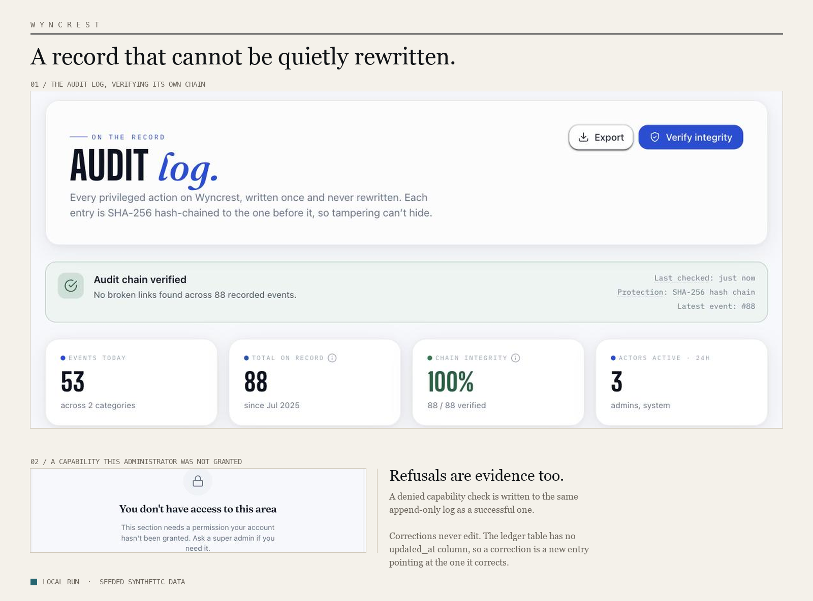
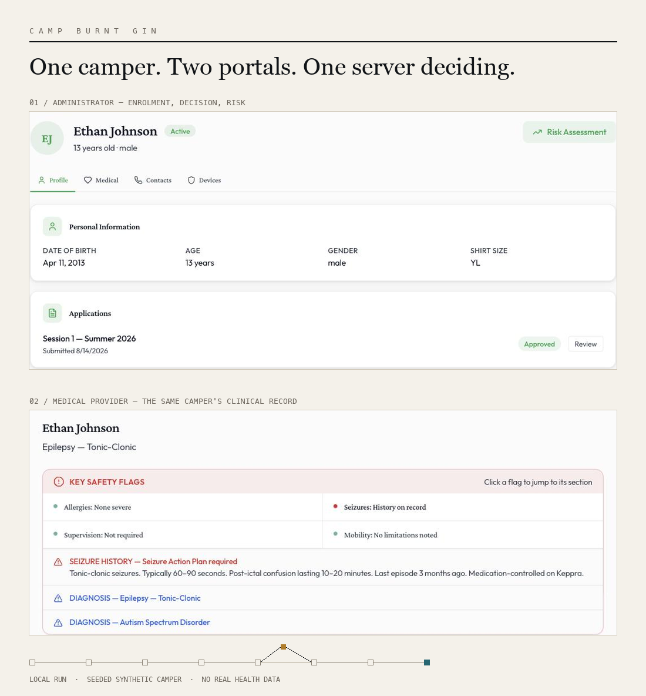

<picture>
  <source media="(prefers-color-scheme: dark)" srcset="assets/masthead-dark.svg">
  
</picture>

Permissions, financial records, audit trails, and evidence-backed decisions. I turn complicated institutional workflows into systems that can explain what happened, who was allowed to act, and what supports the result.

**[Portfolio](https://elton-sakyi-portfolio.vercel.app)** &nbsp;·&nbsp; **[Résumé](https://elton-sakyi-portfolio.vercel.app/Elton_Sakyi_CV.pdf)** &nbsp;·&nbsp; **[LinkedIn](https://www.linkedin.com/in/elton-sakyi/)** &nbsp;·&nbsp; **[eltonsakyi@proton.me](mailto:eltonsakyi@proton.me)**

 

## Wyncrest

Rental operations for tenants, landlords and administrators, built so a dispute is settled from the record rather than argued from memory. Charges and payments are written once, and a correction is a new entry pointing at the one it corrects.

|  |  |
|---|---|
| `01 / INVARIANT` | The ledger table has no `updated_at` column |
| `02 / EVIDENCE` | 1,101 tests passing · CI green · chain verified across 88 events |
| `03 / STATE` | Public · Active development · Live demo, HTTP only |

**[Repository](https://github.com/Knight-Frost/Wyncrest)** &nbsp;·&nbsp; [Live demo](http://18.216.245.190) &nbsp;·&nbsp; [Authorization model](https://github.com/Knight-Frost/Wyncrest/blob/main/docs/AUTHORIZATION.md)

 

## Camp Burnt Gin

Enrolment and medical workflows for a state programme serving children with special health care needs. Four role-scoped portals read one camper record, and what each portal may see is decided by a policy class rather than by the screen that asked.

|  |  |
|---|---|
| `01 / INVARIANT` | Clinical access is conditioned on a camper being active, not on rank |
| `02 / EVIDENCE` | 94 encrypted fields across 21 models · Larastan, Pint and PHPUnit on PHP 8.2 to 8.4 in CI |
| `03 / STATE` | Public · Primary engineer on a four-person capstone · Not deployed |

**[Repository](https://github.com/Knight-Frost/camp-burnt-gin-platform)** &nbsp;·&nbsp; [Contributors](https://github.com/Knight-Frost/camp-burnt-gin-platform/blob/main/CONTRIBUTORS.md)

 

---

### Also public

**[Portfolio](https://github.com/Knight-Frost/portfolio)** &nbsp; `Live · Maintained` 
Four modules that run each project's real logic instead of showing pictures of it. One hand-written `requestAnimationFrame` camera, no animation library. [Open it](https://elton-sakyi-portfolio.vercel.app)

**[FutureYou](https://github.com/Knight-Frost/Future-You)** &nbsp; `Prototype · Hackathon build` 
Six days at LetsBuild 26.3. Models what a money decision costs before you make it: a deterministic engine computes, and the explanation layer may only describe. No test suite.

**[Timeloop Snake](https://github.com/Knight-Frost/timeloop-snake)** &nbsp; `Public · No longer deployed` 
A Canvas game where a ghost of your previous run returns every fourteen seconds and repeats your moves.

### In private development

**Policora** connects each insurance-policy fact to the page it came from, and keeps uncertainty instead of resolving it away. **Pathfinder** keeps labour and education data traceable to its federal sources. `Private · Publication review` I am glad to walk through either.

---

### How I work

**Corrections preserve history.** A financial error creates a compensating entry. The original stays readable. [`create_ledger_entries_table.php`](https://github.com/Knight-Frost/Wyncrest/blob/main/database/migrations/2024_01_01_000015_create_ledger_entries_table.php)

**Permission is decided on the server.** An interface can hide a control. Only the server can refuse the action, and the refusal is logged. [`EnsureAdminCan.php`](https://github.com/Knight-Frost/Wyncrest/blob/main/app/Http/Middleware/EnsureAdminCan.php)

**Absence stays absence.** Missing information is never quietly turned into a zero or a certainty.

**Unfinished work says so.** A capability defined but not yet enforced reports itself that way in code. [`AdminCapability.php`](https://github.com/Knight-Frost/Wyncrest/blob/main/app/Enums/AdminCapability.php)

### How these were built

I use AI coding tools as part of implementation and review. Architecture, security boundaries and public claims remain mine. The decisions that matter are recorded in code, tests and documentation, so they can be inspected independently of how quickly they were produced.

### Now

Preparing Policora for a public read. Available for full-time software engineering roles, backend and platform work most of all.

**[eltonsakyi@proton.me](mailto:eltonsakyi@proton.me)**
