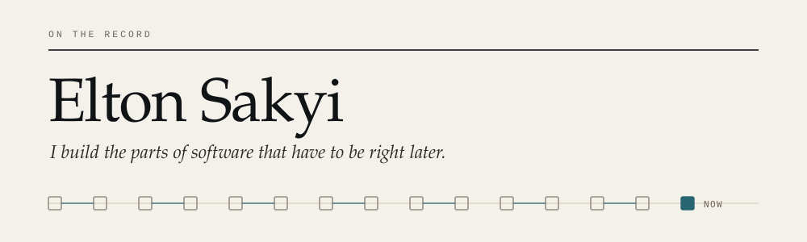

<picture>
  <source media="(prefers-color-scheme: dark)" srcset="assets/masthead-dark.svg">
  
</picture>

I work on the parts of a system that are hard to fix once they are wrong: who is allowed to do what, what happened to the money, what the record says six months later, and what a result is actually based on.

Four platforms, built around that concern. Two are public, and one of them is running where you can open it.

[Portfolio](https://elton-sakyi-portfolio.vercel.app) &nbsp;·&nbsp; [Résumé](https://elton-sakyi-portfolio.vercel.app/Elton_Sakyi_CV.pdf) &nbsp;·&nbsp; [LinkedIn](https://www.linkedin.com/in/elton-sakyi/) &nbsp;·&nbsp; [eltonsakyi@proton.me](mailto:eltonsakyi@proton.me)

---

## 01 &nbsp; Selected systems

### [Wyncrest](https://github.com/Knight-Frost/Wyncrest) &nbsp;Laravel 12 · React · TypeScript

A rent dispute is an argument about what happened. Most systems cannot settle one, because the records that would settle it can be edited.

Wyncrest is a rental operations platform where they cannot. Charges, payments and privileged actions are written once. A correction is a new entry that points at the one it corrects, so the original stays readable. Every administrative action is appended to a SHA-256 chained log, and a refused action is written to that log too, because an attempt to exceed authority is exactly the thing an audit needs to see.

I built the ledger engine, the hash-chain and its backfill migration, the twelve-capability admin model enforced server side across roughly 260 routes, and the test suite.

**Evidence** &nbsp; 1,101 tests passing (verified 2 September 2026) · [the ledger table has no `updated_at` column](https://github.com/Knight-Frost/Wyncrest/blob/main/database/migrations/2024_01_01_000015_create_ledger_entries_table.php) · [denials are audited](https://github.com/Knight-Frost/Wyncrest/blob/main/app/Http/Middleware/EnsureAdminCan.php) · [authorization model](https://github.com/Knight-Frost/Wyncrest/blob/main/docs/AUTHORIZATION.md)
**Try it** &nbsp; [Live demo](http://18.216.245.190) (HTTP only, no TLS. A single showcase instance, not a production environment.)
**Status** &nbsp; Implemented and running. Actively developed.

### [Camp Burnt Gin](https://github.com/Knight-Frost/camp-burnt-gin-platform) &nbsp;Laravel 12 · React · TypeScript

An enrolment platform for a state programme serving children with special health care needs. Four role-scoped portals read one camper record, and what each portal may see is decided by a policy class rather than by the interface that called it. Health information is encrypted at rest across 94 fields in 21 models, and review transitions are decided on the server against session capacity and document compliance.

The access rule I find most interesting is conditional rather than positional: medical staff can open a record only while the camper is approved. An applicant who was rejected, or has not been reviewed yet, is not readable by clinical staff at all. Authorization here depends on the state of the record, not only on the role asking.

One boundary is documented and not yet built. Administrative roles currently pass the medical policy check, so an administrator can read a medical file. Separating administrative authority from clinical access is the next piece of work, and it is written down as a known limitation rather than implied to be finished.

It began as a four-person university capstone. I was the primary engineer for the platform, and authored the API, the client, the authorization architecture, the medical-records domain, the test suite and the CI pipeline. Contributors are credited in the repository.

**Evidence** &nbsp; [encrypted medical attributes](https://github.com/Knight-Frost/camp-burnt-gin-platform/tree/main/backend/camp-burnt-gin-api/app/Models) · [the policy classes, including the one that is too permissive](https://github.com/Knight-Frost/camp-burnt-gin-platform/tree/main/backend/camp-burnt-gin-api/app/Policies) · 148 migrations · CI runs Larastan, Pint and PHPUnit on a PHP 8.2, 8.3 and 8.4 matrix · [contributors](https://github.com/Knight-Frost/camp-burnt-gin-platform/blob/main/CONTRIBUTORS.md)
**Status** &nbsp; Implemented. Not deployed. Known limitations are documented in the repository.

### [Portfolio](https://github.com/Knight-Frost/portfolio) &nbsp;Next.js 15 · React 19

Screenshots show that a system exists. They do not show how it decides anything. This site carries four interactive modules that run the actual logic of each project: a role explorer where the most privileged account still cannot read a medical file, a ledger that refuses a duplicate at the boundary, a query path that shows its sources, and a deterministic projection.

The scroll camera is one hand-written `requestAnimationFrame` loop writing styles directly to the DOM. There is no animation library, because routing sixty frames a second through React state would re-render the tree to produce styles React would then have to diff.

Each module states plainly that it is a model rather than production data.

**Evidence** &nbsp; [Live](https://elton-sakyi-portfolio.vercel.app) · [the camera](https://github.com/Knight-Frost/portfolio/blob/main/components/camera/cinematic.tsx) · TypeScript in strict mode with `noUncheckedIndexedAccess`
**Status** &nbsp; Live and maintained.

### [FutureYou](https://github.com/Knight-Frost/Future-You) &nbsp;Next.js · PostgreSQL · Prisma

Built in six days at the LetsBuild 26.3 hackathon. Most personal finance tools report what you already spent. This one models what a decision will cost you before you make it, through a deterministic arithmetic layer that computes the numbers and an explanation layer that is only allowed to describe them.

Fourteen pages, six engine modules, a documented formula set and a written log of every bug found during the build.

**Evidence** &nbsp; [financial engine](https://github.com/Knight-Frost/Future-You/blob/main/documentation/FINANCIAL_ENGINE.md) · [implementation log](https://github.com/Knight-Frost/Future-You/blob/main/documentation/IMPLEMENTATION.md)
**Status** &nbsp; Feature-complete prototype. No automated test suite, and not deployed. Both would be required before it ran anywhere real.

### Private development

Two larger systems are not public yet.

**Policora** turns insurance policy documents into structured, versioned coverage information where every extracted fact links back to the page it came from, and where uncertainty is preserved instead of resolved away. Python, Java and TypeScript, with a shared contract regenerated and diffed in CI so the three languages cannot drift apart.

**Pathfinder** connects federal labour, occupation and education data into one queryable layer for education and career decisions. Sources stay distinguishable rather than averaged together, and a missing statistic renders as missing rather than as zero.

Both are in development and neither is production ready. I am glad to walk through either one.

---

## 02 &nbsp; How I work

A few rules that show up in all of this code.

**Corrections are new entries, not edits.** A ledger that can be edited cannot settle an argument. [`create_ledger_entries_table.php`](https://github.com/Knight-Frost/Wyncrest/blob/main/database/migrations/2024_01_01_000015_create_ledger_entries_table.php)

**A refused action is evidence.** Permission checks run on the server, and a denial is written to the audit log with the capability that was missing. [`EnsureAdminCan.php`](https://github.com/Knight-Frost/Wyncrest/blob/main/app/Http/Middleware/EnsureAdminCan.php)

**Access can depend on the state of the record, not just the role asking.** Clinical staff can open a camper's file only while that camper is approved. [`app/Policies`](https://github.com/Knight-Frost/camp-burnt-gin-platform/tree/main/backend/camp-burnt-gin-api/app/Policies)

**Unfinished work says so.** A capability that is defined but not yet enforced reports itself that way in code, and limitations are written down where a reader will find them rather than where they will not. [`AdminCapability::isEnforced()`](https://github.com/Knight-Frost/Wyncrest/blob/main/app/Enums/AdminCapability.php)

**A claim should name the file that proves it.** Every number on this page points at something you can open.

---

## 03 &nbsp; How these were built

I use AI coding tools heavily, and the commit history says so.

What those tools did not decide: that the ledger is append-only with compensating entries instead of mutable rows, that a denied permission check is itself an audit event, that clinical access is conditioned on a camper's approval state, that a missing federal statistic must render as missing rather than as zero, and that a document extraction has to cite the page it came from or not be shown at all.

Those are the decisions I would defend in a review. Each one is written down, enforced in code, and covered by a test.

---

## 04 &nbsp; Now

Bringing Policora to a state where it can be read publicly, which mostly means finishing the identity work and deciding what belongs in the open.

Available for full-time software engineering roles. Backend and platform work interests me most.

**[eltonsakyi@proton.me](mailto:eltonsakyi@proton.me)** &nbsp;·&nbsp; [LinkedIn](https://www.linkedin.com/in/elton-sakyi/) &nbsp;·&nbsp; [Portfolio](https://elton-sakyi-portfolio.vercel.app)
